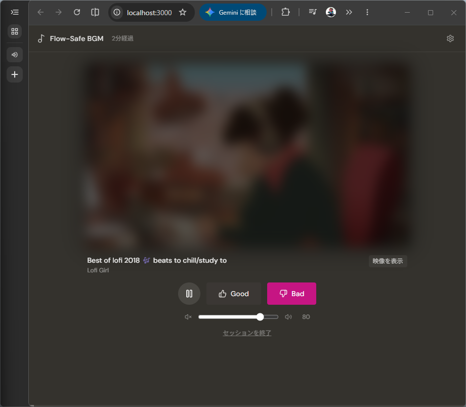

# Flow-Safe BGM Player



仕事集中用 YouTube BGM プレイヤー。Good/Bad 評価によるパーソナライズ、煽りワード自動フィルタリング、映像をぼかして音だけに集中できる機能、ポモドーロタイマーが向いていない人のための120分フェードアウト機能を備えたローカル完結型 Web アプリです。

## なぜ作ったか

YouTube で作業用 BGM を流そうとすると、気づいたら関係ない動画を見ている——そんな経験はないでしょうか。

YouTube のアルゴリズムは「次の動画を見てもらうこと」に最適化されています。サムネイル、タイトル、おすすめ欄、すべてが集中を奪う方向に設計されています。

Flow-Safe BGM Player はその逆を目指しています。**BGM だけを流す、それだけ**。検索もおすすめもない。Good/Bad で自分好みに育てていくだけのシンプルなプレイヤーです。

---

## セットアップ（3ステップ）

### 事前準備

- [Node.js](https://nodejs.org/) v18 以上
- pnpm（入っていない場合は `npm install -g pnpm` でインストール）
- YouTube Data API v3 のキー（[取得方法](#youtube-data-api-v3-キーの取得)を参照）

### 手順

**1. クローン＆インストール**

```bash
git clone https://github.com/masakiishitani/flow-safe-bgm-player.git
cd flow-safe-bgm-player
pnpm install
```

**2. APIキーを設定**

プロジェクトフォルダに `.env` ファイルを作成します。

**Windows（PowerShell 推奨）：**

```powershell
Set-Content -Path ".env" -Value "VITE_YOUTUBE_API_KEY=YOUR_API_KEY" -Encoding UTF8
```

> **注意**: メモ帳で `.env` を作成すると UTF-16 BOM 付きになり、Vite が読み込めません。必ず PowerShell か VSCode で作成してください。

**Mac / Linux：**

```bash
echo "VITE_YOUTUBE_API_KEY=YOUR_API_KEY" > .env
```

**3. 起動**

```bash
pnpm dev
```

ブラウザで `http://localhost:3000` を開いたら完了です。

---

## ワンクリック起動（Windows）

毎回コマンドを打つのが面倒な場合は、以下の内容を `start-bgm.bat` という名前でデスクトップに保存してください。

```bat
@echo off
cd /d C:\path\to\flow-safe-bgm-player
start "" http://localhost:3000
pnpm dev
```

> **保存方法**: メモ帳で「名前を付けて保存」→ ファイル名を `start-bgm.bat`、ファイルの種類を「すべてのファイル」に変更して保存。

ダブルクリックするだけでサーバーが起動し、ブラウザが自動で開きます。終了するときはコマンドプロンプトを閉じるだけです。

---

## YouTube Data API v3 キーの取得

1. [Google Cloud Console](https://console.cloud.google.com/) にアクセスしてログイン
2. 新しいプロジェクトを作成（例: `flow-safe-bgm`）
3. 「APIとサービス」→「ライブラリ」→「YouTube Data API v3」を検索して「有効にする」
4. 「APIとサービス」→「認証情報」→「認証情報を作成」→「APIキー」を選択
5. 表示された `AIzaSy...` で始まるキーをコピーして `.env` の `YOUR_API_KEY` に貼り付ける

> **無料枠について**: 1日あたり最大100回程度の検索が可能です。個人利用では十分な量です。

---

## 使い方

1. キーワード（例: `lofi hip hop`, `作業用BGM`, `jazz study`）を入力して「再生開始」をクリック
2. BGM が自動再生されます。同じキーワードでも毎回異なる動画がシャッフルで選ばれます
3. **Good** → チャンネルをお気に入りに追加（次回以降優先再生）
4. **Bad** → チャンネルをブロックして次の動画へスキップ
5. **映像をぼかす** → 動画をぼかして集中しやすくする（音は継続）
6. 右上の歯車アイコンから音量調整・データのエクスポート/インポートができます

> **シャッフルの仕組み**: 検索結果を最大50件取得し、ランダムに並び替えて最初の1件を再生します。Bad 評価したチャンネルは除外されるため、使えば使うほど自分好みの動画が出やすくなります。

## タイマー仕様

| タイミング | 動作 |
| :--- | :--- |
| 再生開始 | 経過時間のカウントを開始 |
| 60分経過 | ソフトな時報音（BGM は継続） |
| 120分経過 | 5分かけてフェードアウト → セッション終了 |

### 経過時間の表示

- **ヘッダー**：タイトル「Flow-Safe BGM」の右横に薄く「N分経過」と表示。フェードアウト中は「N分 フェード中」、終了後は「セッション終了」に変わる
- **画面最下端**：3px の細いプログレスバーが左から右へじわじわ伸びる（120分で満タン）。フェードアウト開始でピンクに変色

---

## トラブルシューティング

### APIキーが読み込まれない（`VITE_YOUTUBE_API_KEY` が空になる）

`.env` ファイルのエンコードが原因の可能性があります。PowerShell で以下を実行して作り直してください。

```powershell
Set-Content -Path ".env" -Value "VITE_YOUTUBE_API_KEY=YOUR_API_KEY" -Encoding UTF8
```

### 再生ボタンを押しても何も起きない

ブラウザのコンソール（F12）でエラーを確認してください。APIキーが正しく設定されているか確認してから `pnpm dev` を再起動してみてください。

### ポート 3000 が使用中と言われる

別のアプリがポート 3000 を使っています。コマンドプロンプトで以下を実行してから再起動してください。

```powershell
netstat -ano | findstr :3000
taskkill /PID <表示されたPID> /F
```

---

## 技術スタック

- **フロントエンド**: React 19 + TypeScript + Vite + Tailwind CSS v4
- **プレイヤー**: YouTube IFrame Player API
- **音声**: Web Audio API（時報音の生成）
- **ストレージ**: `localStorage`（サーバー不要・データはブラウザに保存）

> **データの保存について**: Good/Bad 評価やキーワードなどのデータはブラウザの `localStorage` に保存されます。
> - ブラウザのキャッシュ・データクリアを行うと**消えます**
> - ポートが変わると別のデータとして扱われるため、常に `http://localhost:3000` でアクセスしてください（`strictPort: true` で固定済み）
> - データを消したくない場合は、設定パネル（歯車アイコン）の **「設定をエクスポート」** から JSON ファイルとして保存しておいてください。次回は「設定をインポート」で復元できます
- **フォント**: DM Sans

## ライセンス

MIT
